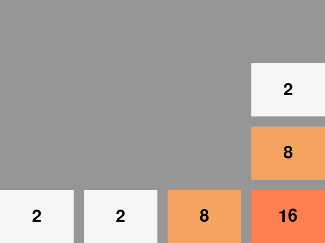

# MiniUI Apps - 2048

[Steward Fu](https://github.com/steward-fu)'s port of 2048.

Source: https://github.com/steward-fu/miyoo-mini/releases (find `2048_<date>.zip`)

## Screenshots

|               In-game               |
|:-----------------------------------:|
|  |

## Installation

**Steward Fu's ports require [Parasyte](../Parasyte.pak), make sure you have it installed!**

## Pre-packaged

1. **Install [Parasyte](../Parasyte.pak)**
2. Download the latest version from Github: https://github.com/erazemk/MiniUI-Apps/releases
3. Extract the archive and move the `2048.pak` directory to your SD card, to the `Tools` directory
(create it if it doesn't exist already)

## Manually packaged

1. Download [Steward Fu's 2048](https://github.com/steward-fu/miyoo-mini/releases)
(find `2048_<date>.zip`)
2. Extract the archive, go into the directory and rename the `2048` directory to `2048.pak`
3. Delete the png files and config.json
4. Replace the existing `launch.sh` file with the one from this repository
(https://raw.githubusercontent.com/erazemk/MiniUI-Apps/main/2048.pak/launch.sh)
5. Move the `2048.pak` directory to your SD card, to the `Tools` directory
(create it if it doesn't exist already)
