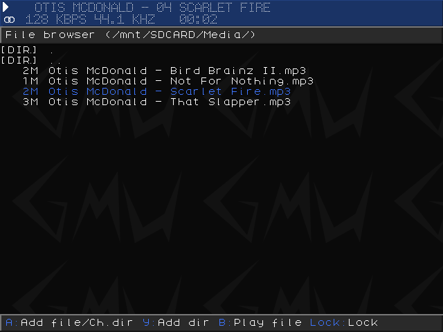
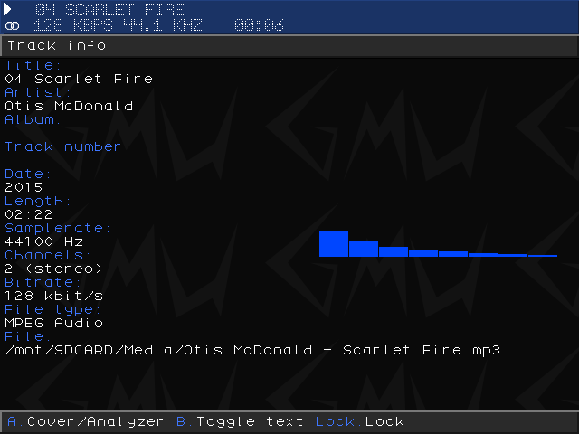

# MiniUI Apps - Gmu

Gmu is a small music player for handheld devices.

Source: https://github.com/TechDevangelist/gmu

## Screenshots

|              File picker              |              Media info              |
|:-------------------------------------:|:------------------------------------:|
|  |  |

## Installation

## Pre-packaged

1. Download the latest version from Github: https://github.com/erazemk/MiniUI-Apps/releases
2. Extract the archive and move the `Gmu.pak` directory to your SD card, to the `Tools` directory
(create it if it doesn't exist already)

## Manually packaged

1. Download [TechDevangelist's Gmu port](https://github.com/TechDevangelist/gmu/releases/latest)
2. Extract the archive and rename the `Gmu` directory to `Gmu.pak`
3. Replace the existing `launch.sh` file with the one from this repository
(https://raw.githubusercontent.com/erazemk/MiniUI-Apps/main/Gmu.pak/launch.sh)
4. Move the `Gmu.pak` directory to your SD card, to the `Tools` directory
(create it if it doesn't exist already)
5. Create a `Media` directory at the root of the SD card and copy your songs
there
