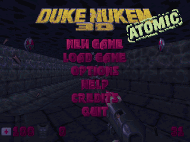
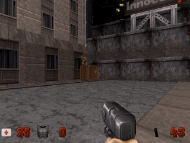

# MiniUI Apps - Rednukem

This is a packaging of nukeykt's Rednukem, a wrapper for the game Duke Nukem (and others), for MiniUI.

Source: https://github.com/nukeykt/NBlood

## Screenshots

|                Main menu                 |                   In-game                   |
|:----------------------------------------:|:-------------------------------------------:|
|  |  |

## Installation

**Since Rednukem is a standalone app, it will NOT be auto-saved when you shut down your Mini,
you alone are responsible for saving progress!**

Save files are stored in `Tools/Rednukem.pak/`.

1. Download the latest version from Github: https://github.com/erazemk/MiniUI-Apps/releases
2. Extract the archive.
3. Copy the following files from the **original game folder** (i.e. from the GOG or Steam version) to
the `Rednukem.pak` folder (dependent on which game you want to play):

- #### Duke Nukem 3D:
	- DUKE3D.GRP
	- DUKE.RTS

- #### Redneck Rampage:
	- REDNECK.GRP
	- REDNECK.RTS
	- optionally CD audio tracks as OGG file in the format trackXX.ogg (where XX is the track number)

- #### Duke Nukem 64:
	- Duke 64 cartridge ROM dump
	- optionally MIDI tracks extracted from DUKE3D.GRP

- #### NAM:
	- NAM.GRP
	- NAM.RTS
	- CON files

- #### World War II GI:
	- WW2GI.GRP
	- WW2GI.RTS
	- CON files

4. Move the `Rednukem.pak` directory to your SD card, to the `Tools` directory (create it if it doesn't exist already).
