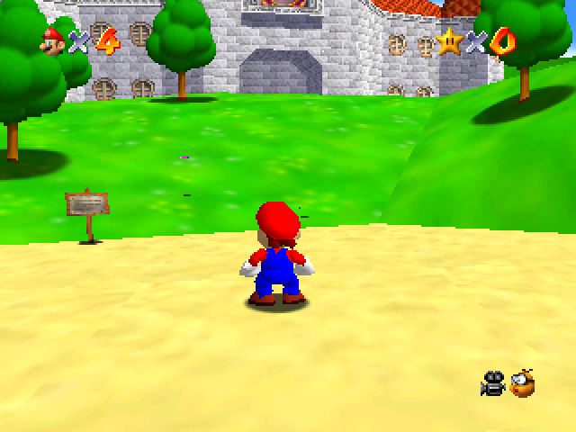

# MiniUI Apps - Super Mario 64

[Steward Fu](https://github.com/steward-fu)'s port of Super Mario 64.

Source: https://github.com/steward-fu/miyoo-mini/releases (find `sm64p_<date>.zip`)

*Keep in mind that the Mini doesn't support Nintendo 64, so the performance is pretty bad.*

## Screenshots

|                       In-game                       |
|:---------------------------------------------------:|
|  |

## Installation

**Steward Fu's ports require [Parasyte](../Parasyte.pak), make sure you have it installed!**

## Pre-packaged

1. **Install [Parasyte](../Parasyte.pak)**
2. Download the latest version from Github: https://github.com/erazemk/MiniUI-Apps/releases
3. Extract the archive and move the `SuperMario64.pak` directory to your SD card,
to the `Tools` directory (create it if it doesn't exist already)

## Manually packaged

1. Download [Steward Fu's sm64p](https://github.com/steward-fu/miyoo-mini/releases)
   (find `sm64p_<date>.zip`)
2. Extract the archive, go into the directory and rename the `sm64p` directory to `sm64p.pak`
3. Delete the png file and config.json
4. Replace the existing `launch.sh` file with the one from this repository
(https://raw.githubusercontent.com/erazemk/MiniUI-Apps/main/SuperMario64.pak/launch.sh)
5. Move the `SuperMario64.pak` directory to your SD card, to the `Tools` directory
(create it if it doesn't exist already)
