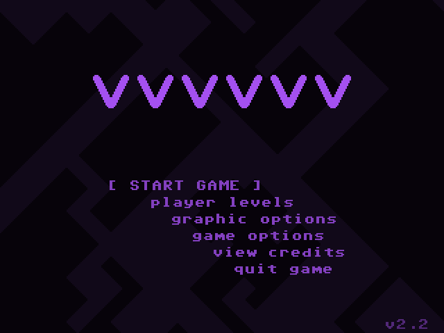

# MiniUI Apps - VVVVVV

[VVVVVV](https://thelettervsixtim.es/) is a fun puzzle-platform game, created by Terry Cavanagh.

Source: https://www.dropbox.com/sh/hqcsr1h1d7f8nr3/AABtSOygIX_e4mio3rkLetWTa
(find `vvvvvv_miyoomini.zip`)

## Screenshots

|                 Main menu                 |                 In-game                 |
|:-----------------------------------------:|:---------------------------------------:|
|  |  |

## Installation

**Since VVVVVV is a standalone app, it will NOT be auto-saved when you shut down your Mini,
you alone are responsible for saving progress!**

Save files are stored in `Tools/VVVVVV.pak/.vvvvvv/saves`.

### Pre-packaged

1. Download the latest version from Github: https://github.com/erazemk/MiniUI-Apps/releases
2. Extract the archive
3. Download latest VVVVVV data files for Linux: https://thelettervsixtim.es/makeandplay/
(or get your own from GOG or Steam)
4. Extract the game archive, find `data.zip` and move it into `VVVVVV.pak`
5. Move the `VVVVVV.pak` directory to your SD card, to the `Tools` directory 
(create it if it doesn't exist already)

### Manually packaged

1. Download [Eggs' VVVVVV Miyoo Mini port](https://www.dropbox.com/sh/hqcsr1h1d7f8nr3/AABtSOygIX_e4mio3rkLetWT)
(find `vvvvvv_miyoomini.zip`)
2. Extract the archive, find the `vvvvvv` directory and rename it to `VVVVVV.pak`
3. Delete all the files from the directory except `libSDL-1.2.so.0` and `vvv_sdl12`
4. Add the `launch.sh` file from this repository
(https://raw.githubusercontent.com/erazemk/MiniUI-Apps/main/VVVVVV/launch.sh)
5. Download latest VVVVVV data files for Linux: https://thelettervsixtim.es/makeandplay/
(or get your own from GOG or Steam)
6. Find `data.zip` in the extracted game directory and move it into `VVVVVV.pak`
7. Move the `VVVVVV.pak` directory to your SD card, to the `Tools` directory
(create it if it doesn't exist already)
