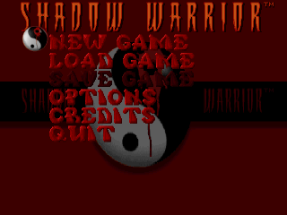
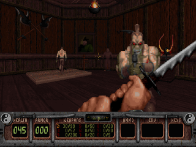

# MiniUI Apps - VoidSW

This is a packaging of Richard Gobeille's VoidSW (which in turn is based on eduke32), a wrapper for the game
Shadow Warrior, for MiniUI.

Source: https://voidpoint.io/terminx/eduke32

## Screenshots

|              Main menu               |                 In-game                 |
|:------------------------------------:|:---------------------------------------:|
|  |  |

## Installation

**Since VoidSW is a standalone app, it will NOT be auto-saved when you shut down your Mini,
you alone are responsible for saving progress!**

Save files are stored in `Tools/VoidSW.pak/`.

1. Download the latest version from Github: https://github.com/erazemk/MiniUI-Apps/releases
2. Extract the archive.
3. Copy the following files from the **original game folder** (i.e. from the GOG or Steam version) to the
`VoidSW.pak` folder:

- SW.GRP
- SW.RTS
- optional: the .GRP of any additional mission pack (like Wanton Destruction)
- optional: For the game to use CD music, place the "music" folder inside of this one.
Make sure the tracks are named correctly (Track0X.ogg).

4. Move the `VoidSW.pak` directory to your SD card, to the `Tools` directory (create it if it doesn't exist already).
